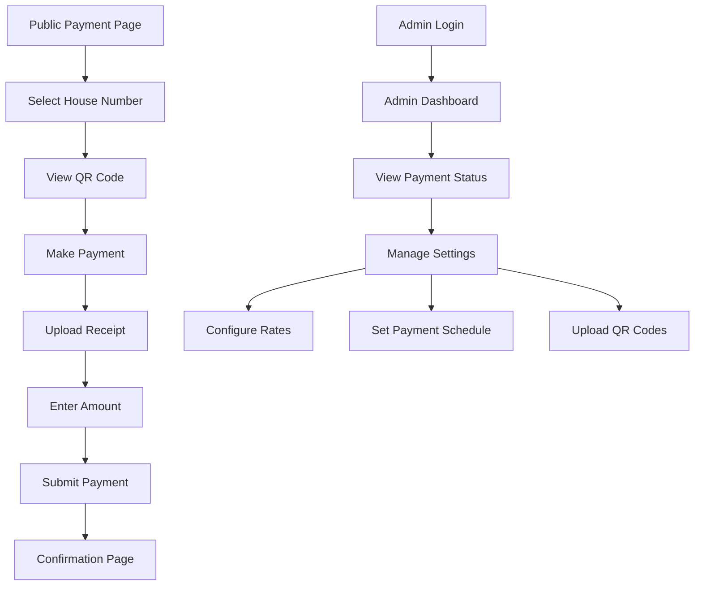

## 1. Product Overview
A comprehensive billing management system for residential properties that enables residents to submit payments through QR code scanning and allows administrators to track billing, payments, and configure billing settings with flexible payment schedules.

The system solves the problem of manual payment tracking and provides transparent billing management for both residents and property administrators.

## 2. Core Features

### 2.1 User Roles
| Role | Registration Method | Core Permissions |
|------|---------------------|------------------|
| Resident | Email/Phone registration | Submit payments, view payment history, download receipts |
| Admin | Pre-configured admin account | Manage billing settings, track all payments, generate reports, upload QR codes |

### 2.2 Feature Module
Our resident billing system consists of the following main pages:
1. **Public Payment Submission**: QR code display, house number selection, receipt upload, amount input
2. **Admin Billing Dashboard**: Payment tracking, debit/credit overview, house payment status
3. **Billing Settings**: Rate configuration, payment schedule setup, QR code management

### 2.3 Page Details
| Page Name | Module Name | Feature description |
|-----------|-------------|---------------------|
| Public Payment Submission | QR Code Display | Display payment QR code image for residents to scan |
| Public Payment Submission | House Selection | Dropdown to select house/unit number from predefined list |
| Public Payment Submission | Receipt Upload | Upload payment receipt image with file validation |
| Public Payment Submission | Amount Input | Input field for payment amount with currency formatting |
| Public Payment Submission | Submit Button | Process payment submission with confirmation |
| Admin Billing Dashboard | Payment Overview | Display total collected amount, pending payments, overdue accounts |
| Admin Billing Dashboard | House Payment Tracking | List view showing each house payment status, debit/credit balance |
| Admin Billing Dashboard | Payment History | Filterable table of all payment transactions with dates |
| Admin Billing Dashboard | Search & Filter | Search by house number, date range, payment status |
| Billing Settings | Rate Configuration | Set billing amount per house/unit type |
| Billing Settings | Payment Schedule | Configure billing frequency: monthly, quarterly, semi-annual, annual |
| Billing Settings | QR Code Management | Upload and manage payment QR code images |
| Billing Settings | House Management | Add/edit/delete house/unit numbers and details |

## 3. Core Process

### Resident Payment Flow
1. Resident accesses public payment page
2. Selects their house number from dropdown
3. Views QR code for payment scanning
4. Makes payment through preferred method
5. Uploads payment receipt and enters amount
6. System confirms payment submission
7. Resident receives confirmation and can download receipt

### Admin Management Flow
1. Admin logs into dashboard
2. Views overall payment status and house balances
3. Monitors pending and overdue payments
4. Configures billing rates and schedules in settings
5. Uploads/maintains QR codes for payments
6. Generates reports and exports data

## 4. User Interface Design

### 4.1 Design Style
- **Primary Color**: Professional blue (#2563EB) for trust and reliability
- **Secondary Color**: Green (#10B981) for successful payments, Red (#EF4444) for overdue
- **Button Style**: Rounded corners with hover effects, primary actions in blue
- **Font**: Clean sans-serif (Inter or system fonts), 16px base size
- **Layout**: Card-based design with clear sections and proper spacing
- **Icons**: Modern line icons for actions and status indicators

### 4.2 Page Design Overview
| Page Name | Module Name | UI Elements |
|-----------|-------------|-------------|
| Public Payment Submission | QR Code Section | Centered QR code image (300x300px), download button below |
| Public Payment Submission | House Selection | Dropdown with search functionality, shows house numbers |
| Public Payment Submission | Payment Form | File upload area with drag-drop, amount input with currency symbol |
| Admin Dashboard | Overview Cards | 3 summary cards showing total collected, pending, overdue amounts |
| Admin Dashboard | House List | Table with house number, resident name, balance, status badges |
| Billing Settings | Rate Config | Input fields for different house types, save changes button |
| Billing Settings | Schedule Setup | Radio buttons for frequency selection, date picker for billing cycle |

### 4.3 Responsiveness
Desktop-first design approach with mobile responsiveness. The public payment page will be optimized for mobile viewing since residents will likely access it on their phones. Admin dashboard will be primarily desktop-focused but responsive for tablet use.