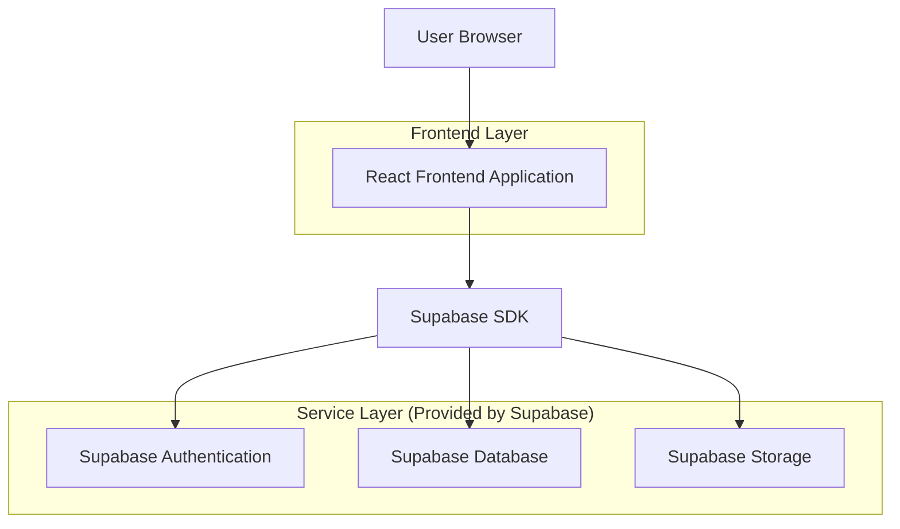
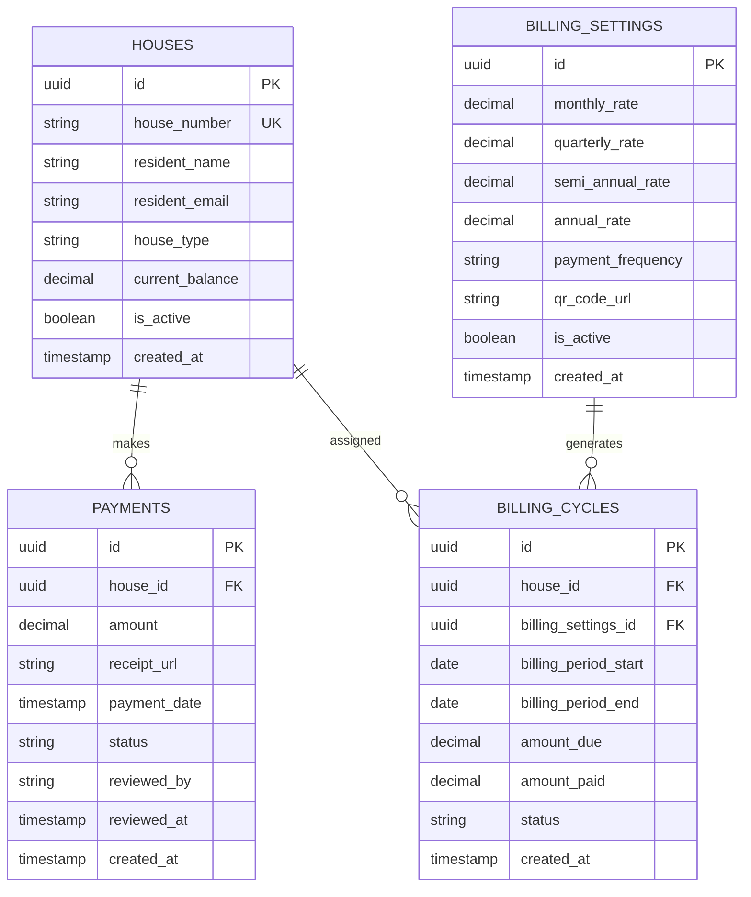

## 1. Architecture Design



## 2. Technology Description

- **Frontend**: React@18 + tailwindcss@3 + vite
- **Initialization Tool**: vite-init
- **Backend**: Supabase (BaaS)
- **Database**: PostgreSQL (via Supabase)
- **Storage**: Supabase Storage for receipt and QR code images

## 3. Route Definitions

| Route | Purpose |
|-------|---------|
| / | Public payment submission page |
| /admin | Admin dashboard with authentication |
| /admin/dashboard | Billing overview and payment tracking |
| /admin/settings | Billing configuration and QR code management |
| /payment-confirmation | Success page after payment submission |

## 4. API Definitions

### 4.1 Core API (via Supabase)

**Payment Submission**
```
supabase.from('payments').insert()
```

Request:
| Param Name | Param Type | isRequired | Description |
|------------|------------|------------|-------------|
| house_id | uuid | true | Reference to houses table |
| amount | decimal | true | Payment amount |
| receipt_url | string | true | Storage URL of uploaded receipt |
| payment_date | timestamp | true | Date of payment |
| status | string | true | 'pending', 'confirmed', 'rejected' |

**Get Payment History**
```
supabase.from('payments').select('*').eq('house_id', houseId)
```

**Update Payment Status**
```
supabase.from('payments').update({status: 'confirmed'}).eq('id', paymentId)
```

## 5. Data Model

### 5.1 Data Model Definition



### 5.2 Data Definition Language

**Houses Table**
```sql
CREATE TABLE houses (
    id UUID PRIMARY KEY DEFAULT gen_random_uuid(),
    house_number VARCHAR(50) UNIQUE NOT NULL,
    resident_name VARCHAR(100) NOT NULL,
    resident_email VARCHAR(255),
    house_type VARCHAR(50) NOT NULL,
    current_balance DECIMAL(10,2) DEFAULT 0.00,
    is_active BOOLEAN DEFAULT true,
    created_at TIMESTAMP WITH TIME ZONE DEFAULT NOW(),
    updated_at TIMESTAMP WITH TIME ZONE DEFAULT NOW()
);

CREATE INDEX idx_houses_number ON houses(house_number);
CREATE INDEX idx_houses_active ON houses(is_active);
```

**Payments Table**
```sql
CREATE TABLE payments (
    id UUID PRIMARY KEY DEFAULT gen_random_uuid(),
    house_id UUID REFERENCES houses(id) ON DELETE CASCADE,
    amount DECIMAL(10,2) NOT NULL CHECK (amount > 0),
    receipt_url TEXT NOT NULL,
    payment_date DATE NOT NULL,
    status VARCHAR(20) DEFAULT 'pending' CHECK (status IN ('pending', 'confirmed', 'rejected')),
    reviewed_by UUID REFERENCES auth.users(id),
    reviewed_at TIMESTAMP WITH TIME ZONE,
    created_at TIMESTAMP WITH TIME ZONE DEFAULT NOW(),
    updated_at TIMESTAMP WITH TIME ZONE DEFAULT NOW()
);

CREATE INDEX idx_payments_house ON payments(house_id);
CREATE INDEX idx_payments_status ON payments(status);
CREATE INDEX idx_payments_date ON payments(payment_date);
```

**Billing Settings Table**
```sql
CREATE TABLE billing_settings (
    id UUID PRIMARY KEY DEFAULT gen_random_uuid(),
    monthly_rate DECIMAL(10,2) NOT NULL CHECK (monthly_rate > 0),
    quarterly_rate DECIMAL(10,2) NOT NULL CHECK (quarterly_rate > 0),
    semi_annual_rate DECIMAL(10,2) NOT NULL CHECK (semi_annual_rate > 0),
    annual_rate DECIMAL(10,2) NOT NULL CHECK (annual_rate > 0),
    payment_frequency VARCHAR(20) DEFAULT 'monthly' CHECK (payment_frequency IN ('monthly', 'quarterly', 'semi-annual', 'annual')),
    qr_code_url TEXT,
    is_active BOOLEAN DEFAULT true,
    created_at TIMESTAMP WITH TIME ZONE DEFAULT NOW(),
    updated_at TIMESTAMP WITH TIME ZONE DEFAULT NOW()
);
```

**Billing Cycles Table**
```sql
CREATE TABLE billing_cycles (
    id UUID PRIMARY KEY DEFAULT gen_random_uuid(),
    house_id UUID REFERENCES houses(id) ON DELETE CASCADE,
    billing_settings_id UUID REFERENCES billing_settings(id) ON DELETE CASCADE,
    billing_period_start DATE NOT NULL,
    billing_period_end DATE NOT NULL,
    amount_due DECIMAL(10,2) NOT NULL,
    amount_paid DECIMAL(10,2) DEFAULT 0.00,
    status VARCHAR(20) DEFAULT 'pending' CHECK (status IN ('pending', 'paid', 'overdue')),
    created_at TIMESTAMP WITH TIME ZONE DEFAULT NOW(),
    updated_at TIMESTAMP WITH TIME ZONE DEFAULT NOW()
);

CREATE INDEX idx_billing_cycles_house ON billing_cycles(house_id);
CREATE INDEX idx_billing_cycles_period ON billing_cycles(billing_period_start, billing_period_end);
```

**Row Level Security Policies**
```sql
-- Grant basic read access to anon role
GRANT SELECT ON houses TO anon;
GRANT SELECT ON billing_settings TO anon;

-- Grant full access to authenticated role
GRANT ALL PRIVILEGES ON houses TO authenticated;
GRANT ALL PRIVILEGES ON payments TO authenticated;
GRANT ALL PRIVILEGES ON billing_settings TO authenticated;
GRANT ALL PRIVILEGES ON billing_cycles TO authenticated;

-- RLS Policies for payments (residents can only see their own payments)
ALTER TABLE payments ENABLE ROW LEVEL SECURITY;

CREATE POLICY "Residents can view own payments" ON payments
    FOR SELECT USING (
        auth.uid() IN (
            SELECT auth.users.id 
            FROM auth.users 
            WHERE auth.users.email = (
                SELECT houses.resident_email 
                FROM houses WHERE houses.id = payments.house_id
            )
        )
    );

CREATE POLICY "Anyone can insert payment" ON payments
    FOR INSERT WITH CHECK (true);

-- RLS Policies for billing cycles
ALTER TABLE billing_cycles ENABLE ROW LEVEL SECURITY;

CREATE POLICY "Residents can view own billing cycles" ON billing_cycles
    FOR SELECT USING (
        auth.uid() IN (
            SELECT auth.users.id 
            FROM auth.users 
            WHERE auth.users.email = (
                SELECT houses.resident_email 
                FROM houses WHERE houses.id = billing_cycles.house_id
            )
        )
    );
```

**Initial Data Setup**
```sql
-- Insert default billing settings
INSERT INTO billing_settings (monthly_rate, quarterly_rate, semi_annual_rate, annual_rate, payment_frequency) 
VALUES (100.00, 290.00, 570.00, 1100.00, 'monthly');

-- Insert sample houses
INSERT INTO houses (house_number, resident_name, resident_email, house_type, current_balance) 
VALUES 
    ('A-101', 'John Doe', 'john@example.com', '1-Bedroom', 0.00),
    ('A-102', 'Jane Smith', 'jane@example.com', '2-Bedroom', 100.00),
    ('B-201', 'Bob Johnson', 'bob@example.com', 'Studio', 0.00);
```